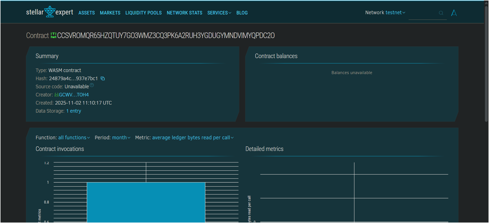

# Crowdfunding Platform with Milestone-Based Releases


## Project Title
**Crowdfunding Platform with Milestone-Based Releases**

A decentralized crowdfunding platform built on Stellar's Soroban blockchain that ensures transparency and protects backers through milestone-based fund releases.

---

## Project Description

This smart contract implements a Kickstarter-like crowdfunding platform where funds are released to project creators only when they achieve predetermined milestones. The system protects backers from fraud by ensuring that funds are not fully released upfront, but rather distributed incrementally as the project progresses and meets its commitments.

The platform leverages blockchain technology to provide:
- **Transparent fund management** - All contributions and releases are recorded on-chain
- **Milestone-based releases** - Funds are locked until specific milestones are verified and approved
- **Backer protection** - Money is only released when creators demonstrate progress
- **Immutable records** - Campaign details and milestone completions are permanently stored

---

## Project Vision

Our vision is to revolutionize crowdfunding by creating a trustless, transparent ecosystem where:

1. **Backers can confidently support projects** knowing their funds are protected and will only be released upon verified progress
2. **Creators can build credibility** by demonstrating their ability to meet milestones and deliver on promises
3. **The crowdfunding industry becomes more accountable** through blockchain-enforced milestone verification
4. **Innovation is encouraged** by reducing the risk for both creators and backers

We aim to bridge the trust gap in traditional crowdfunding platforms by replacing centralized control with smart contract automation, ensuring fair and transparent fund management for all parties involved.

---

## Key Features

### 1. **Campaign Creation**
- Project creators can launch crowdfunding campaigns with customizable targets
- Define the number of milestones required for project completion
- Set specific funding goals and project descriptions

### 2. **Secure Contributions**
- Backers can contribute funds to active campaigns
- All contributions are tracked transparently on the blockchain
- Funds are held securely in the smart contract until milestone approval

### 3. **Milestone Management**
- Creators define specific milestones with detailed descriptions
- Each milestone has an associated release amount
- Milestones must be approved before funds are released

### 4. **Milestone-Based Fund Release**
- Funds are released only when milestones are completed and approved
- Progressive release mechanism ensures ongoing project accountability
- Prevents creators from accessing all funds upfront

### 5. **Transparency & Verification**
- All campaign data is publicly viewable on-chain
- Milestone completion status is immutably recorded
- Backers can track campaign progress in real-time

### 6. **Campaign Status Tracking**
- Monitor total funds raised vs. target amount
- Track completed milestones vs. total milestones
- View active/inactive campaign status

---

## Future Scope

### Enhanced Features
1. **Voting Mechanism**
   - Implement backer voting for milestone approval
   - Weighted voting based on contribution amounts
   - Democratic decision-making for fund releases

2. **Refund Functionality**
   - Automatic refunds if campaigns fail to meet targets
   - Partial refunds for incomplete milestones
   - Time-locked refund mechanisms

3. **Multi-Tier Rewards System**
   - NFT-based rewards for different contribution levels
   - Early backer benefits and exclusive perks
   - Tiered access to project updates

4. **Dispute Resolution**
   - Decentralized arbitration for milestone disputes
   - Third-party validator network
   - Reputation system for creators and backers

5. **Advanced Analytics**
   - Campaign performance metrics
   - Backer engagement analytics
   - Success rate tracking and predictions

6. **Cross-Chain Integration**
   - Support for multiple blockchain networks
   - Cross-chain fund transfers
   - Interoperability with other DeFi protocols

7. **Escrow Services**
   - Automated escrow for large contributions
   - Multi-signature requirements for milestone approval
   - Time-locked fund releases

8. **KYC/AML Integration**
   - Optional identity verification for creators
   - Compliance with regulatory requirements
   - Enhanced trust and credibility

9. **Social Features**
   - Campaign commenting and updates
   - Creator-backer communication channels
   - Community building tools

10. **Mobile Application**
    - Native mobile apps for iOS and Android
    - Push notifications for milestone updates
    - Seamless contribution experience

---

## Technical Stack

- **Blockchain**: Stellar Soroban
- **Smart Contract Language**: Rust
- **SDK**: Soroban SDK

---

## Getting Started

### Prerequisites
- Rust toolchain
- Soroban CLI
- Stellar account for testing

### Installation
```bash
# Clone the repository
git clone <repository-url>

# Build the contract
soroban contract build

# Deploy to network
soroban contract deploy --wasm target/wasm32-unknown-unknown/release/crowdfunding.wasm
```

---

## Contributing

We welcome contributions from the community! Please feel free to submit issues, fork the repository, and create pull requests for any improvements.

---

## Contrat Details
Contract ID: CCSVROMQR65HZQTUY7GO3WMZ3CQ3PK6A2RUH3YGDUGYMNDVIMYQPDC2O

---

**Built with ❤️ for a more transparent and trustworthy crowdfunding ecosystem**